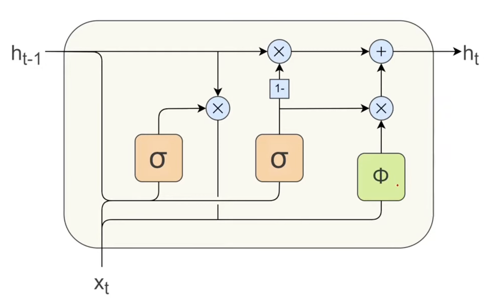
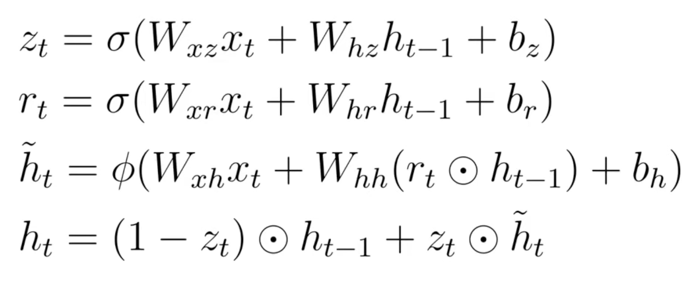

# Gated Recurrent Units (GRU)

A **GRU** is a streamlined version of the LSTM that achieves similar performance with fewer gates and less computation. It merges the LSTM's cell state and hidden state into a single **hidden state** \(h_t\), and uses only **two gates** to control information flow.

---

## Overview

| Property | GRU | LSTM |
|---|---|---|
| Gates | **2** (Reset + Update) | 3 (Forget + Input + Output) |
| Internal networks | 3 | 4 |
| Memory mechanism | Single hidden state \(h_t\) | Separate cell state + hidden state |
| Long-term memory | Good | Slightly better (more gates) |
| Computation | **Lower** | Higher |

---

## Gate 1: Reset Gate \(r_t\)

The **Reset Gate** controls how much of the *previous* hidden state is allowed to influence the candidate hidden state, similar to the Forget Gate in an LSTM.

**Formula:**

$$r_t = \sigma(W_{xr} x_t + W_{hr} h_{t-1} + b_r)$$

1. Take the previous hidden state \(h_{t-1}\) and current input \(x_t\)
2. Multiply by their respective weight matrices \(W_{xr}\), \(W_{hr}\) and add bias \(b_r\)
3. Apply **sigmoid** --> output \(r_t \in (0, 1)\)
4. \(r_t\) is multiplied element-wise with \(h_{t-1}\) before feeding into the candidate state

A value near **0** means "forget most of the past"; near **1** means "keep most of the past".

---

## Candidate Hidden State \(\tilde{h}_t\)

The **Candidate Hidden State** is a proposed new hidden state which is similar to what we *could* set \(h_t\) to:

$$\tilde{h}_t = \tanh(W_{xh} x_t + W_{hh}(r_t \odot h_{t-1}) + b_h)$$

1. Current input \(x_t\) is projected by \(W_{xh}\)
2. Previous hidden state \(h_{t-1}\), **gated by** \(r_t\) (element-wise), is projected by \(W_{hh}\)
3. Sum both projections, add bias \(b_h\), apply **tanh** --> output in \((-1, 1)\)

The reset gate determines how much of \(h_{t-1}\) shapes this candidate.

---

## Gate 2: Update Gate \(z_t\) --> Final Hidden State \(h_t\)

The **Update Gate** decides how much of the *candidate* to accept vs. how much of the *old* hidden state to carry forward:

$$z_t = \sigma(W_{xz} x_t + W_{hz} h_{t-1} + b_z)$$

$$h_t = z_t \odot \tilde{h}_t + (1 - z_t) \odot h_{t-1}$$

- \(z_t \approx 1\): take mostly from the candidate (new information wins)
- \(z_t \approx 0\): keep mostly the old hidden state (memory is preserved)

The final \(h_t\) is a **weighted blend** of the old memory and the new candidate, controlled entirely by \(z_t\).

---

## GRU vs. LSTM

| | LSTM | GRU |
|---|---|---|
| Gates | Forget, Input, Output | Reset, Update |
| Internal networks | 4 | 3 |
| Long-term memory | Better (explicit cell state) | Good |
| Computation cost | Higher | **Lower** |
| When to use | Long sequences, complex dependencies | Faster training, comparable results |
