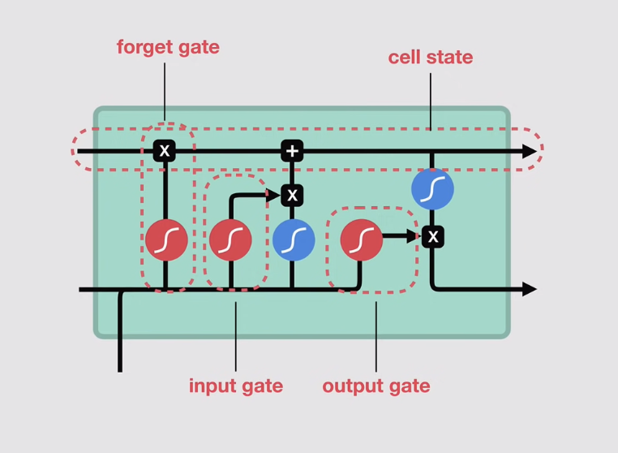

# Long Short Term Memory (LSTM)

## Recap of RNN

- words get transformed into machine readable vectors
- process one by one
- while processsing the words, it passes previous hidden state (memory) into next step of the sequence
- hidden state acts at NN memory
- input + hidden state combined to from vector
- vector goes through tanh activation
- tanh squeeze values between -1 to 1, thus regulating NN values

## LSTM
---

### Cell State

- acts as a transport highway that transports information all the way down to the sequence chain
- something like memory of the network
- since it can carry information throughout the sequence processing, information from the earlier timestep can be carried all the way to the last time step
- therefore reducing the effects of short term memory

### Gates

- information gets added or removed from the call states via gates (as it moves from through timesteps)
- gates are just different neural network that decides which information is allowed on the cell states
- it learns which information is important to prevent the model from forgetting it during training
- gates contains sigmoid activation functions
- similar to the tanh, but it squeezes values to 0 to 1
- values that multiply with 0 is still 0
- this means that information that was deemed not important will remain unimportant while passing through timesteps

#### 1) Forget Gate

- decides what information should be thrown or kept
- information from previous hidden state and information from current input is passed through the sigmoid function
- values come out between 0 to 1 (values closer to 0 we throw, values closer to 1 we keep)

#### 2) Input Gate

- to update the cell state we have the input gate
- we pass the previous hidden state and the current input put into a sigmoid function and a tanh function seperately (in parallel)
- sigmoid function decides which values will be updated by transforming values from 0 to 1
- tanh function squeezes values from -1 to 1
- we then multiply both tanh output and the sigmoid output together
- sigmoid output will decide which information is important to keep from the tanh output
- cell state is multiplied by the Forget Vector
- possibility of dropping values in a cell state if it gets mulitplied by values near 0
- we take the output from Input Gate and do a addition to update Cell State to new values

#### 3) Output Gate

- output gate decides what the next hidden state should be
- we pass the previous hidden state and the input into a sigmoid function
- then we pass newly modified cell state to the tanh function
- we multiply the sigmoid output with the tanh output to decide what information the hidden state should carry
- the output is the hidden state
- the new cell state and the new hidden state is then carried over to the next time step

