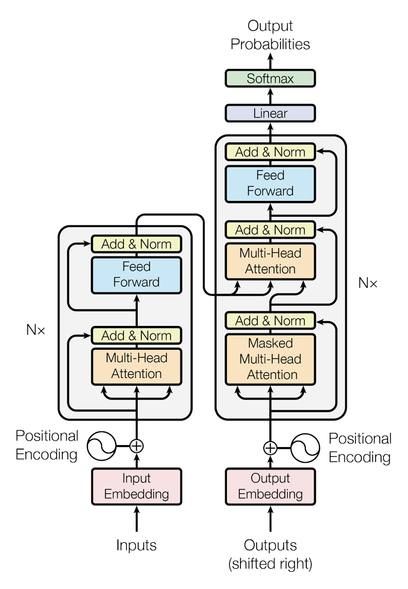
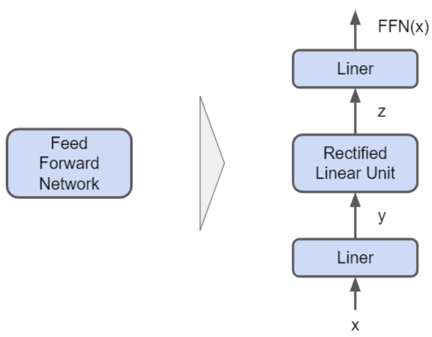
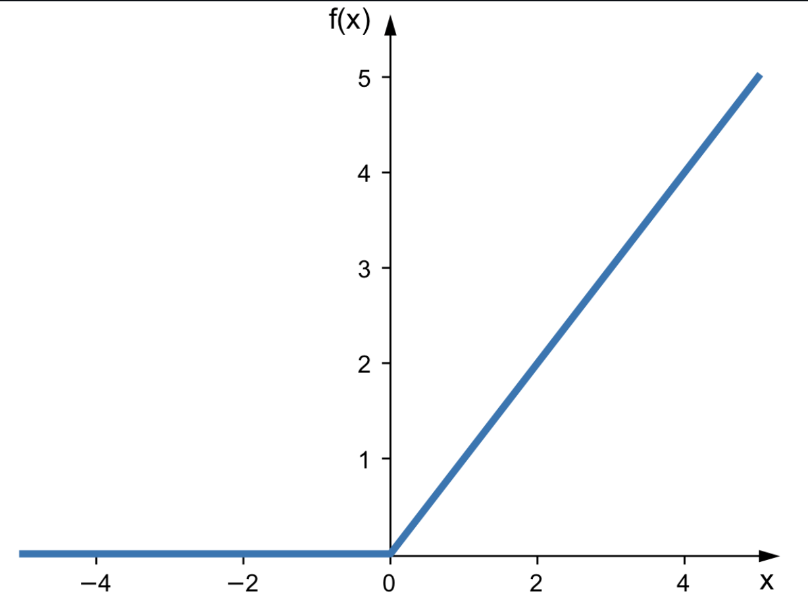

# Transformers



The above diagram shows the transformer architecture. The transformer follows this overall structure using stacked **self-attention** and **point-wise, fully connected layers** for both the **encoder** and **decoder**.

---

## Component 1: Input Embedding & Positional Encoding

### Structure

#### (1) Tokenization

- to allow machines to understand human language, the words first go through a **tokenizer**
- this **tokenizer** gives every sub-word, punctuation, start and end of sentences a **unique integer**
- example:
    - `101` --> `[CLS]` (means start of a sentence)
    - `4972` --> `cat`
    - if its banana, it will be split into sub-words `'ba'`, `'na'`, `'na'`, each with their own tokens
- After every element in the sentence recieves a token, the shape is **`(4, 10)`**

#### (2) Embedding Layer

- this **input tensor** then pases through the **embedding layer** (entering the model)
- Assuming our input is in batches of **4 sentences**
- each sentence contains **10 words** (therefore 10 tokens)
- Inside this layer, contains a **'lookup table'** (master cheat-sheet matrix) that the model keeps in its memory
- this table has 1 row for every unique integer ID given to every token
- each row contains a long vector of continuous decimals or floating point numbers/floats (e.g. **512 numbers**)
- when a word (with integer `4972`) passes through this gate, the embedding layer uses it like a **row address**
- it read the `4972` and then finds this number in the address book
- it then returns the full long vector of continuous decimals (float)
- the 512 numbers per word (per integer ID) is what the model **learns during training**
- after leaving the embedding layer, the new tensor shape is **`(4, 10, 512)`**
    - `4` is the 4 sentences in this single batch
    - `10` represents the 10 words in a single sentence
    - `512` represents 512 floats (forming a long vector) in a word

#### (3) Positional Embedding

2 ways:
- **(1) Sinusoidal Positional Embeddings** (Original 2017 Transformer)
- **(2) Learned Positional Embeddings**

---

***(1) Sinusoidal Positional Embeddings (Original 2017 Transformer):***

- the model generates 512 floats for different token positions on the fly using strict **sine and cosine math wave formulas**
- if we only use 1 cosine/sine, we might get the same positional embedding for e.g. token 2 and token 13, because sinusoids are continuous
- Using both sine and cosine means that shifting from position $pos$ to position $pos + k$ corresponds to a **fixed rotation that depends only on $k$**
- The attention mechanism which is built on linear operations, can therefore easily learn to **attend by relative offsets**, since "look $k$ tokens back" is the same linear transformation everywhere in the sentence
- by using sine and consine, we can also restrict each position to **-1 and 1** (just a bonus)
- since our word vector has 512 slots (512 unique floating point numbers per word)
- we have 512 unique dimensions which gets its own sinusoid at its own frequency therefore, each and every 512 positional embeddings are **unique and different** from each other

$$PE_{(pos, 2i)} = \sin\left(\frac{pos}{10000^{2i/d_{model}}}\right)$$

$$PE_{(pos, 2i+1)} = \cos\left(\frac{pos}{10000^{2i/d_{model}}}\right)$$

- **PE** --> positional encoding
- **pos** is the unqiue position
- this forms a single **512 dimensional positional vector** for that specific position (and many other positions)

***(2) Learned Positional Embeddings:***

- Just like how there is a look up for each specific integer token
- We have a **look up for positions** in a single sentence
- Meaning, 3rd word has a vector representation of `(0,25, -1.42, ...)`, spanning a length of the same 512 floats
- we **add** each word's vector representation with the positional embeddings of the same shape
- note that for learned positions, the table is limited to a **maximum sequence length** of 512 or 2048 rows
- similarly, this look up table that contains all these values, are **learned and improve with training**

---

- all tokens now is a vector in a **N-dimensional vector space** that also their individual psoitional embeddings
- In this space, these words or discrete text tokens have **continuous, high dimensional vectors**
- words with similar contextual meanings sit **close to one another** in this vector space

---

## Component 2: Multi-Head Attention (MHA)

### Structure

- attention is all you need indeed
- **self-attention** forces every single word vector to calculate a **"relationship score"** with every other word vector in the sentence at the same time

#### Step A: Creation of Q, K, V

- our tokens with positional embeddings are named $X$ and shaped **`(4, 10, 512)`**

> **4** is the 4 sentences in this single batch, **10** represents the 10 words in a single sentence, **512** represents 512 floats (forming a long vector) in a word

- Inside the Multi-Head Attention layer, are **3 independent, trainable weight matrix grids**: $W_Q$, $W_K$, $W_V$
- Each grid has a layout of **512 rows × 512 columns**
- the columns transform into 3 specialized vector descriptions per token:

$$Q = XW_Q$$

$$K = XW_K$$

$$V = XW_V$$

- All 3 layers maintain a structure of **`(4, 10, 512)`**

#### Step B: Splitting into Heads

- The model doesn't calculate across all 512 columns in one single block
- that would force the model to focus on only **one global relationship pattern** at a time
- instead it splits the 512 columns into **8 seperate heads**
- For every word, column 0-63 goes into Head 1, columns 64-127 goes to Head 2, and so on
- Each head is an independent processing channel of dimension $d_k = 64$.
- we split the 512 descriptive float slots into **8 independent groups (Heads)**
- data shape transforms to **`(4, 8, 10, 64)`**

> **4** independent sentences, **8** parallel processing paths, **10** words in each path, each word now has only **64** descriptive floats inside that specific path

#### Step C: Creating the Word Relationship Grid ($Q \times K^T$)

- starting shape: $Q$ is `(4, 8, 10, 64)` and $K$ is `(4, 8, 10, 64)`
- now we calculate how much **attention each word should pay to every other word**
- We take query matrix and multiply it the the **transpose** of Key matrix
- Traspose so that we can perform matrix multiplication (need to satisfy the shape requirement)
- Ending shape: **`(4, 8, 10, 10)`**
- if we look at a single head for a single sentence, we are essentially multiplying `(10 x 64)` (remove the 4, 8 part) by `(64 x 10)` (cos its transposed) giving us `(10 x 10)`
- this is a flat **`10 x 10` grid** that compares word 1 to word 2, ..., word 10
- the shape `(4, 8, 10, 10)` means that we have 4 sentences and **8 unique relationship maps**, each sized as a flat 10 x 10 grids

#### Step D: Softmax Percentage Weighting

- apply **softmax** to each values in all the 10 x 10 grids
- it just converts these scores to lie between **0 and 1**, and adding them up to **100%**
- This is now our **Attention Weight Matrix**
- Shape remains the same of `(4, 8, 10, 10)`

> **Reminder:** Immediately before applying the Softmax function, the model divides the raw scores by $\sqrt{d_k}$ (which is $\sqrt{64} = 8$). This is called **Scaled Dot-Product Attention**. Without this downscaling, the numbers inside the matrix multiplication would grow too large, causing the Softmax function to clip and freeze the training process.

#### Step E: Extracting the Information (Scores $\times V$)

- Starting Shapes: Weights are `(4, 8, 10, 10)` and Values ($V$) are `(4, 8, 10, 64)`
- We take our **percentage map** (10 x 10) and multiply it by the actual **data payload values** ($V$) which have a size of (10 x 64)
- The Math: Look at a single head's operation:

$$\mathbf{(10 \times 10) \times (10 \times 64) = (10 \times 64)}$$

- Ending Shape: **`(4, 8, 10, 64)`**

#### Step F: Concatenation

- Starting Shape: `(4, 8, 10, 64)`
- We are done with our 8 separate channels
- We want to bring the data back to its **original global structure**
- So now we take the 8 heads and **concatenate** (glue) their columns back together side-by-side and then multiply it with a learnable **output matrix $W_O$**

$$MultiHead(Q, K, V) = Concat(head_1, ..., head_h)W_O$$

- 8 heads $\times$ 64 floats per head $=$ **512 total floats per token** (meaning 512 features per word)
- Ending Shape: **`(4, 10, 512)`**

---

## Component 3: Layer Normalization & Residual Connections

### Structure

- This is the **`Add Step`** (Residual or skip Connection) and a **`Norm step`** (Layer Normalization)
- **`Add Step`** allows for un-mutated bypass highway that takes the original input tensor from *before* the attention layer (Q, K, V) and adds it directly to the output *after* the attention layer
- the residual concept is similar to the **residual in ResNet architecture**
- this preserves the original word identities and allows **gradients to flow backwards** during training completely unobstructed
- **`Norm Step`** recalculates the distribution of the float values across the embedding channle sfor each word, forcing them back into a unified range
- this keeps the scale of data **perfectly bounded**

#### Step A: The Residual Skip

- Before entering Multi-Head Attention, our tensor copy $X$ (shaped `(4, 10, 512)`) branches off into 2 paths
- **Path A** goes into MHA
- **Path B** acts as an *identity shortcut*, travelling past the attention block

$$\mathbf{\text{Fused Tensor}} = \mathbf{X} + \text{MHA}(\mathbf{X})$$

- This means float #1 of Word 1 in Sentence 1's original vector is added directly to float #1 of Word 1 in Sentence 1's attention-updated vector. The shape stays perfectly static at **`(4, 10, 512)`**

#### Step B: Layer Normalization (Standardizing the Sliders)

- the model looks across the **512 embedding feature columns** for each individual word row
- For one single word row (a vector of 512 floats), it calculates:
    - **Mean** (average value) of those 512 floats
    - **Variance** (how far spread out the numbers are from the average)
    - Subtracts the mean from each float and divides by the standard deviation, This is the formula for normalization learned in JC, **(X-mean)/std**
    - this centers the numbers, forcing the average of all feature values to **0.0** and the standard deviation to **1.0**
    - **Tuned Scaling**: Finally, it multiplies each float by a trainable scaling parameter ($\gamma$) and adds a trainable shifting parameter ($\beta$)

### Mathematical Representation

The entire interaction of this section can be neatly summarized using standard algebraic notations:

$$\text{Layer Output} = \text{LayerNorm}\Big(\mathbf{X} + \text{Attention}(\mathbf{X})\Big)$$

Where the internal row normalization of a single vector component $x_i$ is defined as:

$$\hat{x}_i = \frac{x_i - \mu}{\sqrt{\sigma^2 + \epsilon}} \cdot \gamma + \beta$$

> **Note:** $\epsilon$ is a tiny constant like 1e-5 added to the denominator to prevent a mathematical crash if the variance happens to be exactly zero

---

## Component 4: Position-Wise Feed-Forward Network (FFN)



The final primary processing stage inside a single Transformer layer.

### Structure

- MHA is good at exchanging information between words, but it only performs **linear operations** (matrix multiplications and weighted averages)
- A network restricted to linear math can only learn simple combinations of features, rendering it incapable of processing **deep, abstract language logic** or complex factual knowledge
- FFN applies **non-linear math operations** to every vector individually
- it maps 512 features into a much larger space, applies math activation functions to filter out irrelevant signals and projects back down

#### Step A: Dimensional Expansion

- FFN contains a **pair of trainable linear parameter grids**
- first grid $W_1$ has a physical layout of **512 rows × 2048 columns**
- 512 rows represents the 512 floating values per word
- Every word's 512 descriptive traits are multiplied and combined into a broad array of **2048 hidden feature traits**
- this is basically **expanding the amount of features** per word

#### Step B: Injecting Non-Linearity (The Activation Gate)

- The expanded tensor of 2048 columns is immediately passed through a **non-linear activation function**, such as **ReLU** (Rectified Linear Unit) or **GELU** (Gaussian Error Linear Unit)
- this operation goes through all 2048 column values **element by element**



- This image shows a **ReLU** or **Rectified Linear Unit Activation Function** that break linearity, turning a smooth linear system into a highly flexible **non-linear model**

#### Step C: Dimensional Contraction

- Now that the features have been synthesized and filtered, the model compresses the table back down to fit the standard model size
- It passes the data through a second trainable linear projection matrix, $\mathbf{W}_2$, which has a physical layout of **2048 rows × 512 columns**
- This matrix condenses the 2048 filtered traits back down into the standard hidden dimension width ($d_{model} = 512$)
    - The shape transforms back to: **`(4, 10, 512)`**
    - **Physical State:** Our 3D data block has returned to its clean baseline dimension, but its internal floating-point numbers have been updated with **synthesized contextual logic**

### Mathematical Representation

The complete operation of the position-wise feed-forward network can be written as a clean composite function:

$$\text{FFN}(X) = \max(0, X \mathbf{W}_1 + b_1) \mathbf{W}_2 + b_2$$

Where:
- $X$ is our **context-aware incoming word matrix**
- $\max(0, \cdot)$ represents the non-linear **ReLU activation filter** clipping negative values to zero
- $b_1$ and $b_2$ are simple trainable **baseline shift vectors (biases)** added during the linear projections

---

## Component 5: The Full Encoder Block

### Structure of the Full Encoder Block

#### (1) Single Transformer Encoder Layer

- Contains **sub-layer 1 (Attention Assembly)** which includes the Multi-Head Attention, Residual Skip Connection and Layer Normalization
- **Sub-layer 2** is the **Feed Forward Assembly** part which includes the Position-Wise Feed-Forward Network and also FFN's own shortcut (Residual Skip Connection), and the final Layer Normalization

#### (2) Macro Stack ($N \times$ Blocks)

- In a real baseline Transformer, the architecture doesn't just use 1 layer, it chains **6 identical Encoder blocks** together back to back

$$\mathbf{(4, 10, 512)} \longrightarrow \text{Encoder 1} \longrightarrow \text{Encoder 2} \longrightarrow \dots \longrightarrow \text{Encoder 6} \longrightarrow \mathbf{(4, 10, 512)}$$

- When data block leaves the final Encoder layer, it has **exact same dimensions** as it started with
- but values are **rich, deeply contextualizaed information concepts**
- This finalized grid of values is called the **`Encoder Memory Space`**
- we can view it as a **`Source Context Map`**, something like the knowledge extracted from the input sentence

---

## Component 6: Decoder Stack (The Prediction of French from English)

### Structure (Brief Description)

- the target sentence first goes through its own **embeddin layer + positional encoding** (exactly mirroring Component 1 on the encoder side)
- When we are trying to generate text, it is **autoregressive**
- meaning it generates **word by word**
- when predicting 4th word, it must only look at 1st to 3rd word
- If it calculates normal self-attention across the whole target sentence during training, it will accidentally **look ahead**, and fail to learn how to predict
- Decoder consists of **2 Attention Sub-Layers + FFN**:
    1. First Attention layer uses something called **Causal Masking** to block out all the future tokens
    2. Second Attention Layer uses something called **Cross Attention** which acts as a bridge, reading masked target words and looking back at the rich `Encoder Memory Space` to make sure it stays on topic, in other words, this layer has a mechanism that **queries the Encoder Memory Space**

#### Sub-Layer 1: Masked Multi-Head Attention

- data block undergoes exact same treatment as MHA block in Component 2 (Mutli-Head Attention)
- projects into the same $Q$, $K$, and $V$ tensors split into **8 heads**
- and then we have the matrix multiplication $Q \times K^T$
- which gives us the standard square **`12 x 12` Relationship Grid** mapping target words to target words
- But *before* Softmax is applied, we apply the **Causal Mask** which in matrix terms, a **lower triangular matrix blueprint** filled with zeros in the bottom left, and negative infinity ($-\infty$) in the top right
- below shows a 4 by 4 grid for illustration purposes (instead of 12 by 12)

```
               RAW SCORE ATTENTION GRID                        CAUSAL MASK STAMP
            "Je"    "suis"   "un"    "chat"               "Je"    "suis"   "un"   "chat"
"Je":       [ 12.4,   4.2,    -1.1,    0.5  ]           [  0.0,   -inf,   -inf,   -inf  ]
"suis":     [  8.1,  14.3,     2.2,   -3.4  ]    ──►    [  0.0,    0.0,   -inf,   -inf  ]
"un":       [  1.2,   9.5,    11.1,    4.6  ]   (Adds)  [  0.0,    0.0,    0.0,   -inf  ]
"chat":     [  0.1,   2.3,     7.8,   15.2  ]           [  0.0,    0.0,    0.0,    0.0  ]
```

- softmax function now forces $-\infty$ to **0**

#### Sub-Layer 2: Encoder-Decoder Cross-Attention (The Context Bridge)

- The target matrix block `(4, 12, 512)` from sub-layer 1 (after causal masking), wants to read from original sentence matrix block (Encoder Memory Space) `(4, 10, 512)` that was completed by the Encoder
- To do this, Decoder completely **alters who generates the Queries, Key, and Values**:

    1. The **Decoder Tensor** `(4, 12, 512)` multiplies by a weight layer called $W_Q$ in this Cross-Attention Layer to create **Queries ($Q$)**

    2. The **Encoder Memory Space** `(4, 10, 512)` multiplies by **2 seperate weight matrices** in this Cross-Attention Layer called $W_K$ & $W_V$ to create **Keys ($K$) and Values ($V$)** respectively

- when we trace the matrix multiplication $Q \times K^T$ for a single head:
    - $Q$ shape: **(12 rows, 64 columns)**
    - $K^T$ shape: **(64 rows, 10 columns)**

$$\mathbf{(12 \times 64) \times (64 \times 10) = (12 \times 10)}$$

- The result is a **cross-network 12 x 10 Relationship Grid**
- 12 rows high represent **French target words**, and 10 columns wide represents **English source words**
- We then dot product the relationship grid with the encoder's **newly calculated V**
- we collapse everything together and normalize it
- feed it through the same position-wise feed forward network
- all these form **1 decoder block**
- we stack **6 of these together**

### Mathematical Representation

The Cross-Attention engine operating between the two main stacks is structurally defined by mapping inputs to distinct source matrices:

$$\text{CrossAttention}(X_{dec}, X_{enc}) = \text{softmax}\left(\frac{Q_{dec} K_{enc}^T}{\sqrt{d_k}}\right)V_{enc}$$

Where:
- $Q_{dec} = X_{dec}\mathbf{W}_Q$
- $K_{enc} = X_{enc}\mathbf{W}_K$
- $V_{enc} = X_{enc}\mathbf{W}_V$

---

## Component 7: The Final Linear & Softmax Projection Layers

### Structure

- we need to predict next word from **entire vocabulary** (e.g. 100,000+ words)
- a vector of 512 floats **cannot represent a specific single word directly**
- we need a way to **project this "hidden" meaning back up to a "vocabulary" size**

#### Step A: Linear Projection Layer

- We have a final massive weight matrix, $\mathbf{W}_{vocab}$, that has a shape of **(512, 100256)**
- When we matrix-multiply our output by this grid:

$$\mathbf{(12 \times 512) \times (512 \times 100256) = (12 \times 100256)}$$

- Every single one of our 12 output positions now has **100,256 raw numbers (logits)**
- Each number represents a **"vote"** for one of the words in the dictionary. If the number in the "hi" column is very high, the model is signaling that "hi" is a strong candidate for the next word

#### Step B: Softmax Function

- We apply the **Softmax function** to the dictionary dimension (the 100256 columns)
    - It takes the exponent ($e^x$) of every score to make them all **positive**
    - It divides each score by the **sum of all other scores**
- This forces all 100,256 values in each position to become decimals that are strictly btw **0 and 1**, and all adds up to exactly **1.0**

### Mathematical Representation

The final prediction logic is defined by:

$$\text{Probability} = \text{softmax}(X_{final} \mathbf{W}_{vocab} + b)$$

Where:
- $X_{final}$ is the finalized **Decoder output (4, 12, 512)**
- $\mathbf{W}_{vocab}$ is the final **trained linear projection matrix**
- $b$ is the final **bias vector**